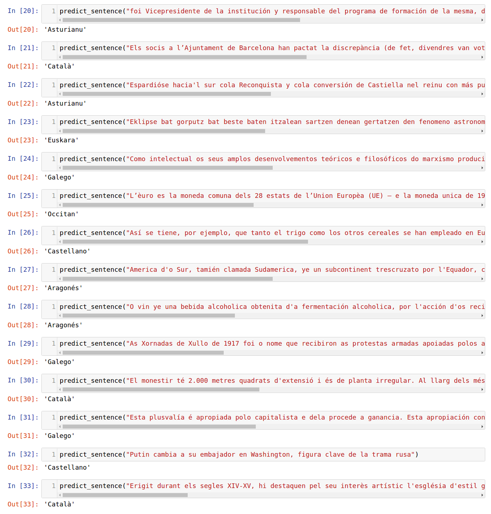

# Detect Language from Text

In this project we will focus on Text Classification. Text Classification has been used in the past for [Sentiment Analysis](https://en.wikipedia.org/wiki/Sentiment_analysis). Here, we will use text classification to classify the language of the input text. 

In order to classify text, we will look at a class of Neural Network where connections between units form a directed cycle, called Recurrent Neural Network (RNNs). RNNs use an internal memory to process sequences of elements and is able to learn from the syntactic structure of text. Our model will be able to classify text based on the text we train it with.

RNNs are [very effective](http://karpathy.github.io/2015/05/21/rnn-effectiveness/) when understanding sequence of elements and have been used in the past to generate or classify text. I will use a Recurrent Neural Network to classify the language of the input text.

The solution below, can be useful in the following scenarios:
- A Global Customer Service team receives all their requests via a single email address. The model below can be used to identify the language of the text and forward it to the right person/group.
- Tagging an email.
- A Government agency of a country that has several regional languages, e.g. Spain, which is what we've used in this notebook to train our model.

*Alternative solution:*
- The Translation API by Google can be used to detect the language of a text, https://cloud.google.com/translate/docs/detecting-language.

## Datasets and Input

To train our model we will use the [recognised languages](https://en.wikipedia.org/wiki/Spain#cite_note-c-6) in [Spain](https://en.wikipedia.org/wiki/Spain) as input. Apart from the official language - Castilian (Spanish), there are different languages spoken in various autonomous communities, e.g. Catalan, Gailicia, Basque, Aragonese, Asturian and Occitan.

The text used as input comes from Wikipedia. We are using the Leipzig Corpora Collection - http://wortschatz.uni-leipzig.de/en/download/ dataset available for each language. We've trained the model with ~ 10,000 sentences per language. 

Each dataset, e.g. [Asturian](http://pcai056.informatik.uni-leipzig.de/downloads/corpora/ast_wikipedia_2016_10K.tar.gz), contains a file with sentences, minimal preprocessing (remove index and append the language name) was done to this file to train our model.

The file included in the Github repository (all_sentences.txt) doesn't require further processing.

## Install

This project has the following dependencies:
- Python 3.6
- Jupyter Notebook
- Numpy
- Pandas
- Scikit-Learn
- Tensorflow 1.1


```bash
cd /path/to/detect-language
```

We will use virtualenv to run our notebook
```bash
virtualenv -p python3 env-dlkeras
source env-dlkeras/bin/activate
pip install -r requirements.txt
jupyter notebook
```

## Run 

Open the [Jupyter](http://jupyter.org/install.html) notebook - Detect Language - Keras.ipynb

## Results

Below a screenshot with the results of the model classifying text it has never seen before:

